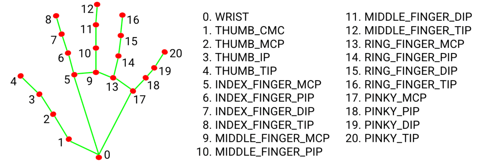
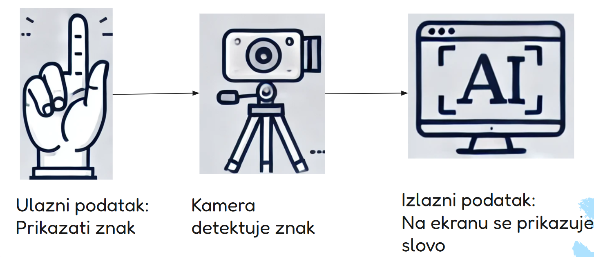
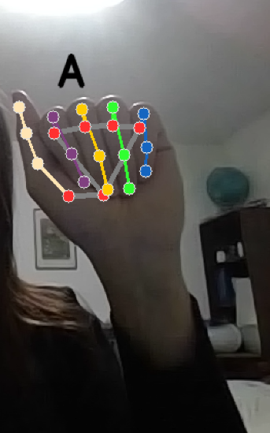
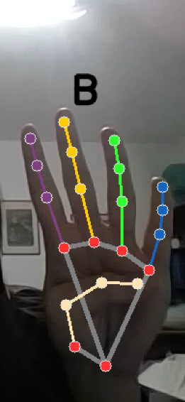

## Sign-language
Aplikacija omogućava gluvonemim osobama da lakše komunikaciju sa osobama koje nemaju ovaj problem. Razvijena je u Pythonu, koristeći biblioteku MediaPipe, koja omogućava praćenje pokreta prstiju u realnom vremenu, koristeći algoritme za prepoznavanje ključnih tačaka na ruci.

## Sadržaj

- [Problem koji aplikacija rešava?](#problem-koji-aplikacija-rešava)
- [Media pipe biblioteka](#media-pipe-biblioteka)
- [Realizacija projekta i struktura](#realizacija-projekta-i-struktura)
- [Koje kompanije i projekti su pokušali da reše problem](#koje-kompanije-i-projekti-su-pokušali-da-reše-problem)
- [Instalacija](#instalacija)

## Problem koji aplikacija rešava?
Glavni problem sa kojim se suočavaju gluvoneme osobe je način na koji komuniciraju sa ljudima koji ne poznaju znakovni jezik. U Srbiji je ovaj problem posebno izražen, jer prema podacima Saveza gluvih i nagluvih Srbije, oko 70.000 osoba koristi srpski znakovni jezik kao svoj prvi jezik. Nažalost, u Srbiji postoji oko 30 tumača znakovnog jezika za 70.000 ljudi. Nedostatak tumača ozbiljno otežava svakodnevni život osoba koje koriste znakovni jezik. Takođe, usluga tumača je uglavnom dostupna samo u kritičnim situacijama, dok su svakodnevne potrebe ove zajednice često zapostavljene.
Ova aplikacija ima za cilj da pomogne u prevazilaženju tog problema. Korišćenjem kamere, korisnik može pokazati znak rukom, a aplikacija će prepoznati i prikazati odgovarajuće slovo. Osim prikaza, aplikacija može i izgovoriti to slovo, pa korisnik može istovremeno slušati i gledati slova, pa čak i cele rečenice

## Mediapipe biblioteka


#### Nastanak Mediapip-a
MedijaPipe ima korene iz ranih 2010-ih kada je Google radio na unapređenju tehnologija mašinskog učenja i računarskog vida. Prvi put je korišćen 2012. godine za analizu video i audio sadržaja u realnom vremenu na YouTube-u.
2018. godine, MediaPipe je počeo da rešava probleme vezane za korišćenje složenih modela računarskog vida na uređajima kao što su pametni telefoni i mali računari. Do 2020. godine, javila se rastuća potreba za brzim i efikasnim načinom obrade multimedijalnih sadržaja, pa je MediaPipe ažuriran kako bi odgovorio na ovu potrebu. Danas, MediaPipe ostaje snažna biblioteka za programere koji žele da kreiraju inovativne multimedijalne aplikacije koje funkcionišu veoma dobro.

#### Osnovne funkcionalnosti i tehnologije
MediaPipe dolazi sa mnogim uzbudljivim funkcijama. Jedna od ključnih karakteristika je mogućnost korišćenja snage GPU-ova za bržu obradu podataka. Zahvaljujući ovoj tehnologiji, MediaPipe može obrađivati čak i najzahtevnije multimedijalne zadatke u realnom vremenu. Takođe, zahvaljujući paralelnom procesiranju, MediaPipe može istovremeno obavljati više zadataka, kao što je procesiranje više video tokova ili pokretanje više modela računarskog vida istovremeno.

Pored toga, MediaPipe  moze da koristi OpenCV, moćnu open-source biblioteku za računarski vid. OpenCV pruža mnoge alate i algoritme za obradu slika i video zapisa. Zahvaljujući OpenCV-u, MediaPipe lako dodaje funkcionalnosti poput video snimanja, obrade i prikaza u svojim procesnim tokovima. OpenCV nije deo MediaPipe-a, ali se često koristi zajedno sa njim u aplikacijama za pomoćnu obradu i prikaz.Takođe se integriše sa TensorFlow-om, Google-ovim alatom za mašinsko učenje, što olakšava dodavanje unapred treniranih ili prilagođenih modela. To omogućava jednostavne zadatke poput prepoznavanja lica ili razumevanja govora.

MediaPipe podržava i popularne programske jezike poput C++, Java i Python, što olakšava njegovu primenu u različitim projektima.

#### Modularna arhitektura i grafovi
Jedna od najvažnijih funkcionalnosti MediaPipe-a je njegova modularna arhitektura koja koristi Dataflow Graphs. Ovi grafovi se sastoje od "kalkulatora" (calculators - to je komponenta koja prima podatke, obrađuje ih i vraća rezultat). Svaki calculator ima jasno definisane ulaze i izlaze i radi samo jednu stvar, što olakšava organizaciju i ponovno korišćenje koda. Na primer, jedan kalkulator može da čita video ulaz, drugi da izvršava detekciju lica, dok treći prikazuje rezultat.
Pipeline (ili Dataflow Graph) je niz povezanih calculatora. To je lanac kroz koji putuju podaci. Svaki calculator je karika u tom lancu. MediaPipe koristi grafove da poveže te kalkulatore i definiše kojim redosledom i kako se podaci kreću.
Zahvaljujući ovom modularnom pristupu, razvoj kompleksnih sistema postaje jednostavniji jer se funkcionalnosti mogu lako dodavati, uklanjati ili kombinovati bez potrebe za promenom cele aplikacije.

#### Podrška za različite platforme
MediaPipe je dizajniran da radi na više platformi. Podržava operativne sisteme kao što su Linux, Windows, macOS, Android i iOS. Ovo omogućava razvoj aplikacija koje mogu funkcionisati i na desktop i na mobilnim uređajima. Posebno je optimizovan za mobilne uređaje, čime omogućava izvođenje složenih zadataka računarskog vida direktno na telefonu bez potrebe za internet konekcijom.

#### Predefinisani modeli i rešenja
MediaPipe dolazi sa velikim brojem unapred definisanih rešenja koja omogućavaju brzo postavljanje sistema bez potrebe za dodatnim treniranjem modela. Neka od najpoznatijih rešenja uključuju:
Face Detection – detekcija lica u realnom vremenu<br>
Face Mesh – mapiranje preko 400 tačaka na licu<br>
Hand Tracking – precizno praćenje pokreta ruku i prstiju - koji je korišćen u samoj aplikaciji<br>
Pose Estimation – analiza položaja tela<br>
Objectron – 3D detekcija objekata<br>
Holistic – kombinovano praćenje tela, ruku i lica<br>
Selfie Segmentation – odvajanje korisnika od pozadine<br>
Hair Segmentation – segmentacija kose<br>
Gesture Recognition – prepoznavanje pokreta i gestikulacija<br>

#### Hand Tracking model
MediaPipe Hand Landmarker omogućava detekciju ključnih tačaka (landmarkova) šake na slici. Funkcioniše nad slikama koristeći model mašinskog učenja (ML) i može raditi sa statičkim podacima ili neprekidnim video tokom. Kao izlaz, daje: koordinate ključnih tačaka šake u slici, koordinate ključnih tačaka u 3D prostoru, i informaciju o tome da li je u pitanju leva ili desna ruka, za više detektovanih ruku.
Hand Landmarker koristi paket modela koji sadrži dva ugrađena modela: model za detekciju dlana i model za detekciju ključnih tačaka šake i potreban nam je paket koji sadrži oba ova modela.

Paket modela za detekciju ključnih tačaka šake prepoznaje lokacije 21 ključne tačke unutar detektovanih oblasti šake.


Model za detekciju dlana locira ruke unutar ulazne slike, dok model za detekciju ključnih tačaka prepoznaje specifične tačke na šaci u delu slike koji je definisan od strane modela za detekciju dlana. Pošto je pokretanje modela za detekciju dlana vremenski zahtevno, u režimu rada sa video zapisom, Hand Landmarker koristi bounding box koji je model za ključne tačke šake detektovao u jednom frejmu, kako bi lokalizovao oblast ruke u narednim frejmovima. Hand Landmarker ponovo pokreće model za detekciju dlana samo ako model za ključne tačke više ne prepoznaje prisustvo šake ili ne uspeva da prati šaku u okviru. Ovo smanjuje broj pokretanja modela za detekciju dlana.

### Prednosti MediaPipe
* MediaPipe nudi gotove i dobro optimizovane modele pa samim tim nema potrebe za treniranjem sopstvenih modela: detekciju ruku, praćenje lica, detekciju tela, detekciju objekata, OCR (prepoznavanje teksta)
* Visoke performanse u realnom vremenu: optimizovan za rad u realnom vremenu, čak i na mobilnim uređajima
* Višeplatformska podrška: radi na Windows, Linux, macOS, Android i iOS. Može se koristiti sa Python-om, C++, JavaScript-om, pa čak i u Unity okruženju
* Modularna arhitektura: koristi "pipeline" pristup: svaki deo obrade (npr. prepoznavanje, filtriranje, vizualizacija) je modularan i može se prilagoditi.
* Besplatan i open-source: razvijen od strane Google-a i objavljen pod Apache 2.0 licencom.
* Laka integracija: pruža jednostavne API-je. Može se lako integrisati u postojeće projekte.

### Mane MediaPipe 
* Ograničena prilagodljivost modela: MediaPipe koristi unapred trenirane modele. Ne može se lako trenirati sopstveni modeli unutar MediaPipe okruženja.
* Ograničena preciznost i robusnost: radi odlično u kontrolisanim uslovima, ali gubi preciznost pri lošem osvetljenju, ima problema sa delimično zaklonjenim objektima (npr. ruke iza tela), teže se nosi sa brzim pokretima ili neobičnim pozama
* Ograničena fleksibilnost na mobilnim uređajima: iako postoji podrška za Android i iOS, integracija u mobilne aplikacije može biti teža i zahtevnija u poređenju sa drugim bibliotekama poput TensorFlow Lite.
* Nedostatak detaljne dokumentacije za napredne primene

### MediaPipe vs Open CV vs TensorFlow
MediaPipe, OpenCV i TensorFlow su tri različite tehnologije koje se često koriste zajedno.
MediaPipe je framework za kreiranje pipeline-ova za računarski vid i obradu senzorskih podataka, fokusiran na real-time performanse i modularnost.
OpenCV je biblioteka sa alatima za obradu slika i videa, koja može da se koristi kao pomoćni alat za MediaPipe, naročito za manipulaciju slika, prikaz, čuvanje videa i slične operacije.
TensorFlow je platforma za mašinsko učenje, koja se može integrisati u MediaPipe pipeline da bi se koristili ML modeli za prepoznavanje, klasifikaciju i druge zadatke.


## Realizacija projekta i struktura
#### Struktura projekta
data/<br>
utils/<br>
│<br>
├── __pycache__/<br>
├── create_features.py<br>
├── draw_hand_landmarks.py<br>
├── draw_predicted_character.py<br>
├── extract_hand_landmark_coordinates.py<br>
├── text_to_speech.py<br>
.gitignore<br>
1_collect_imgs.py<br>
2_create_dataset.py<br>
3_train_classifier.py<br>
4_inference_classifier.py<br>
5_speech_to_text.py<br>
data.pickle<br>
model.p<br>

#### Realizacija projekta
Prvi zadatak aplikacije je da se kao ulazni podatak prikaže znak uz pomoć kamere a da je izlazni podatak slovo koje se prikazuje na ekranu.


Prvo je potrebno prikupiti slike koje predstavljaju ulazne podatke. To se obavlja pomoću fajla 1_collect_imgs.py. U okviru ovog fajla koristi se kamera za prikupljanje slika, pri čemu korisnik označava trenutak snimanja pritiskom na taster ENTER. Svaka snimljena slika se čuva u direktorijumu data, u posebnoj fascikli koja odgovara prikazanom simbolu. Ove slike se koriste za kreiranje skupa podataka za treniranje modela. Za svako snimljeno slovo kreira se po 100 slika. Na primer, u direktorijumu data nalaziće se folder A koja sadrži 100 slika slova A iz različitih uglova. Takodje, korisnik ima mogucnost da prekine snimanje slika, klikom na taster ESC.

Program učitava slike ruku iz različitih foldera, pri čemu svaki folder predstavlja jednu klasu (na primer, različite gestove ruke). Zatim koristi MediaPipe (modul mp_hands) za detekciju ruke na svakoj slici. Nakon uspešne detekcije, iz slike se izdvajaju koordinate landmarkova, odnosno zglobova prstiju ruke. Na osnovu tih koordinata kreira se vektor karakteristika (feature vektor), koji predstavlja numeričku reprezentaciju položaja prstiju. Na kraju, svi dobijeni podaci, zajedno sa odgovarajućim klasama (labelama), čuvaju se u .pickle fajl, kako bi mogli da se koriste u narednim fazama, poput treniranja modela mašinskog učenja

###### Inicijalizacija MediaPipe Hand modula
<pre>```mp_hands = mp.solutions.hands
hands = mp_hands.Hands(static_image_mode=True, min_detection_confidence=0.5)```</pre>
###### Učitavanje slika iz foldera
<pre>```for dir_ in os.listdir(DATA_DIR):
    for img_path in os.listdir(os.path.join(DATA_DIR, dir_)):
        features, x_, y_ = [], [], []<br>
        # Čitanje i konverzija slike u RGB
        img = cv2.imread(os.path.join(DATA_DIR, dir_, img_path))
        img_rgb = cv2.cvtColor(img, cv2.COLOR_BGR2RGB)
        #Detekcija ruke
        results = hands.process(img_rgb)
        if results.multi_hand_landmarks:
            for hand_landmarks in results.multi_hand_landmarks:
                x_, y_ = extract_hand_landmark_coordinates(hand_landmarks)
                features = create_features(hand_landmarks, x_, y_)
                data.append(features)
                labels.append(dir_)```</pre>

###### Čuvanje podataka u pickle fajl
<pre>```f = open('data.pickle', 'wb')<br>
pickle.dump({'data': data, 'labels': labels}, f)<br>
f.close()```</pre>
###### Ekstrakcija X i Y koordinata landmarka ruke
<pre>```def extract_hand_landmark_coordinates(hand_landmarks):
    x_ = []
    y_ = []
    for i in range(len(hand_landmarks.landmark)):
        x = hand_landmarks.landmark[i].x
        y = hand_landmarks.landmark[i].y
        x_.append(x)
        y_.append(y)
    return x_, y_```</pre>

###### Kreiranje feature vektora relativno u odnosu na minimalnu vrednost
<pre>```def create_features(hand_landmarks, x_, y_):
    features = []
    for i in range(len(hand_landmarks.landmark)):
        x = hand_landmarks.landmark[i].x
        y = hand_landmarks.landmark[i].y
        features.append(x - min(x_))
        features.append(y - min(y_))
    max_length = 84
    if len(features) < max_length:
        features.extend([0] * (max_length - len(features)))
    return features```</pre>

### Treniranje modela
Ovaj učitava prethodno sačuvane podatke i labele, priprema ih za treniranje, zatim trenira Random Forest model za klasifikaciju pokreta (npr. gestova), testira njegovu tačnost i čuva model zajedno sa mapom oznaka u fajl kako bi se kasnije mogao koristiti za prepoznavanje u realnom vremenu
###### Definisanje putanje do direktorijuma sa podacima
<pre>```DATA_DIR = './data'```</pre>
###### Učitavanje podataka iz pickle fajla
<pre>```labels = sorted(os.listdir(DATA_DIR))
data_dict = pickle.load(open('./data.pickle', 'rb'))```</pre>
###### Mapiranje labela u numeričke vrednosti i obrnuto
<pre>```label_mapping = {label: idx for idx, label in enumerate(labels)}
reverse_label_mapping = {idx: label for label, idx in label_mapping.items()}```</pre>
##### Filtriranje podataka
<pre>```filtered_data = []
filtered_labels = []
for data, label in zip(data_dict['data'], data_dict['labels']):
    if label in label_mapping:
        filtered_data.append(data)
        filtered_labels.append(label_mapping[label])```</pre>
###### Pretvaranje u NumPy nizove
<pre>```data = np.asarray(filtered_data)
labels = np.asarray(filtered_labels)```</pre>
###### Podela na trening i test skup
<pre>```x_train, x_test, y_train, y_test = train_test_split(
    data, labels, test_size=0.2, shuffle=True, stratify=labels)```</pre>
##### Treniranje modela
<pre>```model = RandomForestClassifier(random_state=84)
model.fit(x_train, y_train)```</pre>
##### Model koristi ono što je naučio da predvidi klase za test podatke (x_test) 
<pre>```y_predict = model.predict(x_test)
score = accuracy_score(y_predict, y_test)
print(f'{score * 100:.2f}% of samples were classified correctly!')```</pre>
##### Čuvanje modela
<pre>```with open('model.p', 'wb') as f:
    pickle.dump({'model': model, 'label_mapping': reverse_label_mapping}, f)```</pre>

U fajlu 4_inference_classifier.py se koristi MediaPipe za detekciju šake sa kamere u realnom vremenu, ekstraktuje ključne tačke šake, zatim koristi trenirani model za klasifikaciju znaka (slova) i prikazuje ga na ekranu. Istovremeno, prepoznato slovo se automatski izgovara pomoću sinteze govora, čime se omogućava prevod znakovnog jezika u govor.
##### Inicijalizacija MediaPipe za detekciju šaka
<pre>```mp_hands = mp.solutions.hands
hands = mp_hands.Hands(static_image_mode=True, min_detection_confidence=0.3)```</pre>
##### Glavna petlja koja radi dok ne pritisnemo 'q'
    <pre>``` while True:
    # Čitanje slike sa kamere
    ret, frame = cap.read()
    if not ret:
        print("Neuspešno čitanje slike. Izlazim...")
        break
    # Dimenzije slike
    H, W, _ = frame.shape
    # Pretvaranje slike u RGB format (MediaPipe zahteva RGB)
    frame_rgb = cv2.cvtColor(frame, cv2.COLOR_BGR2RGB)
    ```</pre>
    
##### Obrada slike pomoću MediaPipe za detekciju ruke
    <pre>``` results = hands.process(frame_rgb)
    if results.multi_hand_landmarks:
        for hand_landmarks in results.multi_hand_landmarks:
            # Crtanje tačaka ruke na slici
            draw_hand_landmarks(frame, hand_landmarks)
            # Ekstrakcija x i y koordinata iz tačaka ruke
            x_, y_ = extract_hand_landmark_coordinates(hand_landmarks)
            # Normalizacija i kreiranje niza karakteristika
            features = create_features(hand_landmarks, x_, y_)
            # Korišćenje modela za predikciju znaka
            prediction = model.predict([np.asarray(features)])
            predicted_character = reverse_label_mapping[int(prediction[0])]
            # Prikaz prepoznatog znaka na slici
            draw_predicted_character(frame, x_, y_, W, H, predicted_character)
            # Izgovaranje znaka glasom
            text_to_speech_threaded(predicted_character) ```</pre>

#### Izlaz koji dobijemo




## create virtual environment

```
python -m venv .venv
```

## Select interpreter

```
ctrl+shift+p -> python select interpreter
```


## Dependenices

### Generate requirements.txt from an existing environment:

```
pip freeze > requirements.txt
```

### Install libraries from the requirements.txt file

```
pip install -r requirements.txt
```
