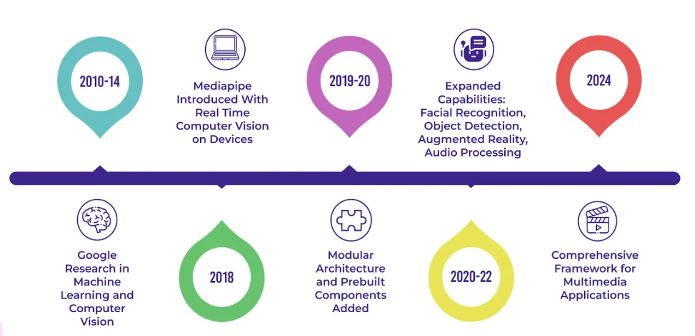
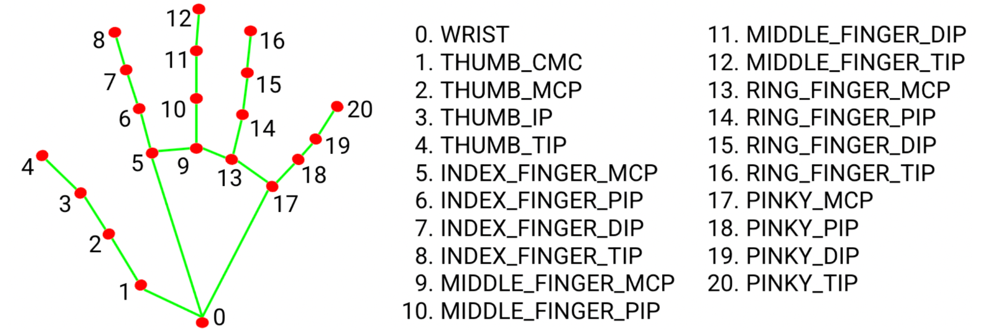
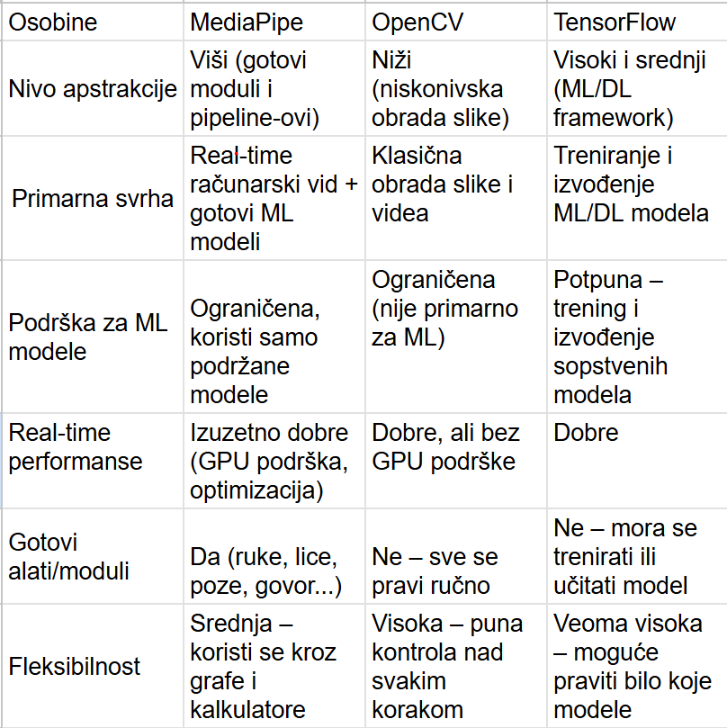
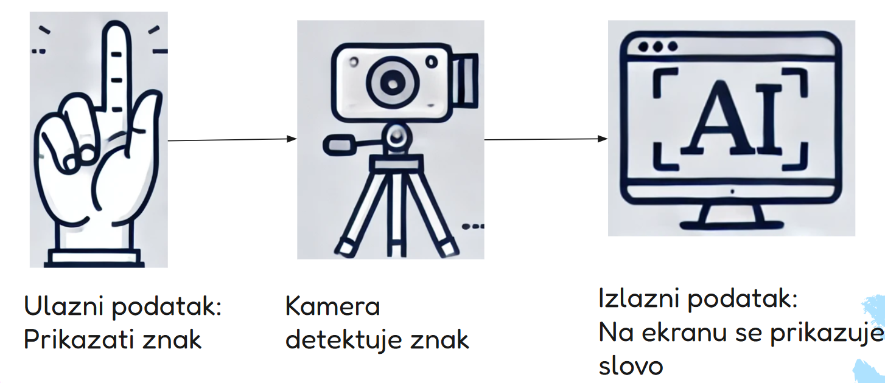
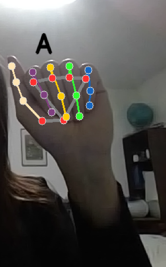
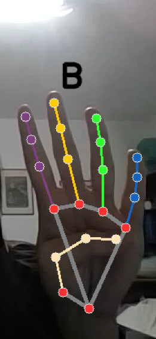

## Sign-language
Aplikacija za prevođenje znakovnog jezika u tekst ili govor u realnom vremenu. Razvijena je u Pythonu, koristeći biblioteku MediaPipe, koja omogućava praćenje pokreta prstiju u realnom vremenu, koristeći algoritme za prepoznavanje ključnih tačaka na ruci.

## Sadržaj
- [Problem koji aplikacija rešava?](#problem-koji-aplikacija-rešava)
- [Mediapipe biblioteka](#media-pipe-biblioteka)
- [Realizacija projekta i struktura](#realizacija-projekta-i-struktura)
- [Instalacija](#instalacija)

## Problem koji aplikacija rešava?
Glavni problem sa kojim se suočavaju gluvoneme osobe je način na koji komuniciraju sa ljudima koji ne poznaju znakovni jezik. U Srbiji je ovaj problem posebno izražen, jer prema podacima Saveza gluvih i nagluvih Srbije, oko 70.000 osoba koristi srpski znakovni jezik kao svoj prvi jezik. Nažalost, u Srbiji postoji oko 30 tumača znakovnog jezika za 70.000 ljudi. Nedostatak tumača ozbiljno otežava svakodnevni život osoba koje koriste znakovni jezik. Takođe, usluga tumača je uglavnom dostupna samo u kritičnim situacijama, dok su svakodnevne potrebe ove zajednice često zapostavljene.
Ova aplikacija ima za cilj da pomogne u prevazilaženju tog problema. Korišćenjem kamere, korisnik može pokazati znak rukom, a aplikacija će prepoznati i prikazati odgovarajuće slovo. Osim prikaza, aplikacija može i izgovoriti slovo pa čak i celu reč, pa korisnik može istovremeno slušati i gledati slova

## Mediapipe biblioteka


#### Nastanak Mediapip-a
MediaPipe je razvio Google, a njegovi počeci potiču iz perioda između 2010. i 2014. godine, kada su započeta istraživanja u oblasti mašinskog učenja i računarskog vida.
Godine 2018. MediaPipe je prvi put predstavljena kao biblioteka za obradu videa u realnom vremenu na uređajima.
U periodu 2019–2020. biblioteka je značajno unapređena — uvedena je modularna arhitektura i dodate su unapred pripremljene komponente, što je omogućilo lakšu implementaciju složenih modela.<br>
Tokom 2020–2022. MediaPipe je dodatno proširena sa novim funkcionalnostima, uključujući prepoznavanje lica, detekciju objekata, obradu zvuka i td.
Od 2024. godine, MediaPipe postaje sveobuhvatna biblioteka za razvoj multimedijalnih aplikacija, sa naglaskom na fleksibilnost, efikasnost i jednostavnu primenu u realnom vremenu.

#### Osnovne funkcionalnosti i tehnologije
MediaPipe dolazi sa mnogim uzbudljivim funkcijama. Jedna od ključnih karakteristika je mogućnost korišćenja snage GPU-a za bržu obradu podataka. Zahvaljujući tome, MediaPipe može obrađivati čak i najzahtevnije multimedijalne zadatke u realnom vremenu. Takođe, zahvaljujući paralelnom procesiranju, MediaPipe može istovremeno obavljati više zadataka, kao što je prokretanje više modela računarskog vida istovremeno.

Pored toga, MediaPipe  moze da koristi OpenCV, moćnu open-source biblioteku za računarski vid. OpenCV pruža mnoge alate i algoritme za obradu slika i video zapisa. Zahvaljujući OpenCV-u, MediaPipe lako dodaje funkcionalnosti poput video snimanja, obrade i prikaza slika. OpenCV nije deo MediaPipe-a, ali se često koristi zajedno u aplikacijama za pomoćnu obradu i prikaz.Takođe se integriše sa TensorFlow-om, Google-ovim alatom za mašinsko učenje, što olakšava dodavanje unapred treniranih ili prilagođenih modela. To omogućava jednostavne zadatke poput prepoznavanja lica ili razumevanja govora.

MediaPipe podržava i popularne programske jezike poput C++, Java i Python, što olakšava njegovu primenu u različitim projektima.

#### Modularna arhitektura i grafovi
Jedna od najvažnijih funkcionalnosti MediaPipe-a je njegova modularna arhitektura koja koristi Dataflow Graphs. Ovi grafovi se sastoje od "kalkulatora" (calculators - to je komponenta koja prima podatke, obrađuje ih i vraća rezultat). Svaki calculator ima jasno definisane ulaze i izlaze i radi samo jednu stvar. Na primer, jedan kalkulator može da čita video ulaz, drugi da izvršava detekciju lica, dok treći prikazuje rezultat.
Pipeline (ili Dataflow Graph) je niz povezanih calculatora. To je lanac kroz koji putuju podaci. MediaPipe koristi grafove da poveže te kalkulatore i definiše kojim redosledom i kako se podaci kreću.
Zahvaljujući ovom modularnom pristupu, razvoj kompleksnih sistema postaje jednostavniji jer se funkcionalnosti mogu lako dodavati, uklanjati ili kombinovati bez potrebe za promenom cele aplikacije.

#### Podrška za različite platforme
MediaPipe je dizajnirana da radi na više platformi. Podržava operativne sisteme kao što su Linux, Windows, macOS, Android i iOS. Ovo omogućava razvoj aplikacija koje mogu funkcionisati i na desktop i na mobilnim uređajima. Posebno je optimizovana za mobilne uređaje, čime omogućava izvođenje složenih zadataka računarskog vida direktno na telefonu bez potrebe za internet konekcijom.

#### Predefinisani modeli i rešenja
MediaPipe dolazi sa velikim brojem unapred definisanih rešenja koja omogućavaju brzo postavljanje sistema bez potrebe za dodatnim treniranjem modela. Neka od najpoznatijih rešenja uključuju:
Face Detection – detekcija lica u realnom vremenu<br>
Face Mesh – mapiranje preko 400 tačaka na licu<br>
Hand Tracking – precizno praćenje pokreta ruku i prstiju <br>
Pose Estimation – analiza položaja tela<br>
Objectron – 3D detekcija objekata<br>
Holistic – kombinovano praćenje tela, ruku i lica<br>
Selfie Segmentation – odvajanje korisnika od pozadine<br>
Hair Segmentation – segmentacija kose<br>
Gesture Recognition – prepoznavanje pokreta i gestikulacija<br>

#### Hand Tracking model
Kada računar treba da prepozna ruku na kameri i odredi gde se nalaze prsti i druge tačke, koriste se dva modela. Prvi model služi za detekciju dlana – on pronalazi gde se ruka nalazi na slici. Drugi model se koristi za detekciju ključnih tačaka i on precizno određuje položaje prstiju, zgloba i ostalih delova ruke.
Ako je u pitanju video (niz slika), nije efikasno da se za svaki frejm iznova pokreće model za detekciju dlana, jer bi to bilo sporo i trošilo bi mnogo resursa. Zato MediaPipe koristi pristup: samo prvi put koristi model za detekciju dlana kako bi pronašao ruku. Nakon toga koristi bounding box – pravougaonik koji obuhvata celu ruku – i prati ruku unutar tog okvira u narednim frejmovima.
Sve dok ruka ostaje unutar tog okvira i može se prepoznati, sistem nastavlja da precizno detektuje ključne tačke bez ponovnog pokretanja modela za detekciju dlana. Međutim, ako se ruka brzo pomeri ili izađe iz okvira, tada se ponovo pokreće model za detekciju dlana kako bi se pronašla nova pozicija ruke.
Paket modela za detekciju ključnih tačaka šake prepoznaje lokacije 21 ključne tačke unutar detektovanih oblasti šake.



### Prednosti MediaPipe
* MediaPipe nudi gotove i dobro optimizovane modele pa samim tim nema potrebe za treniranjem sopstvenih modela: detekciju ruku, praćenje lica, detekciju tela, detekciju objekata...
* Visoke performanse u realnom vremenu: optimizovan za rad u realnom vremenu, čak i na mobilnim uređajima
* Višeplatformska podrška: radi na Windows, Linux, macOS, Android i iOS. Može se koristiti sa Python-om, C++, JavaScript-om, pa čak i u Unity okruženju
* Modularna arhitektura: koristi "pipeline" pristup: svaki deo obrade (npr. prepoznavanje, filtriranje, vizualizacija) je modularan i može se prilagoditi.
* Open-source: razvijena od strane Google-a 

### Mane MediaPipe 
* Ograničena prilagodljivost modela: MediaPipe koristi unapred trenirane modele. Ne može se lako trenirati sopstveni modeli unutar MediaPipe okruženja.
* Ograničena preciznost: radi odlično u kontrolisanim uslovima, ali gubi preciznost pri lošem osvetljenju, ima problema sa delimično zaklonjenim objektima (npr. ruke iza tela), teže se nosi sa brzim pokretima 
* Ograničena fleksibilnost na mobilnim uređajima: iako postoji podrška za Android i iOS, integracija u mobilne aplikacije može biti teža i zahtevnija u poređenju sa drugim bibliotekama poput TensorFlow Lite.
* Nedostatak detaljne dokumentacije za napredne primene

### MediaPipe vs Open CV vs TensorFlow
MediaPipe, OpenCV i TensorFlow su tri različite tehnologije koje se često koriste zajedno.<br>
MediaPipe je framework za kreiranje pipeline-ova za računarski vid i obradu senzorskih podataka, fokusiran na real-time performanse i modularnost.<br>
OpenCV je biblioteka sa alatima za obradu slika i videa, koja može da se koristi kao pomoćni alat za MediaPipe, naročito za manipulaciju slika, prikaz, čuvanje videa i td.<br>
TensorFlow je platforma za mašinsko učenje, koja se može integrisati u MediaPipe pipeline da bi se koristili ML modeli za prepoznavanje, klasifikaciju i druge zadatke.<br>



## Realizacija projekta i struktura
#### Struktura projekta
data/<br>
utils/<br>
│<br>
├── create_features.py<br>
├── draw_hand_landmarks.py<br>
├── draw_predicted_character.py<br>
├── extract_hand_landmark_coordinates.py<br>
├── text_to_speech.py<br>
.gitignore<br>
1_collect_imgs.py<br>
2_create_dataset.py<br>
3_train_classifier.py<br>
4_inference_classifier.py<br>
data.pickle<br>
model.p<br>

#### Realizacija projekta
Zadatak aplikacije je da kao ulaz primi znak preko kamere, a kao izlaz prikaže odgovarajuće slovo na ekranu i izgovori to slovo ili celu rečenicu.


Prvo je potrebno prikupiti slike koje predstavljaju ulazne podatke. To se obavlja pomoću fajla '1_collect_imgs.py'. U okviru ovog fajla koristi se kamera za prikupljanje slika, pri čemu korisnik snima sliku pritiskom na taster ENTER. Svaka snimljena slika se čuva u direktorijumu data. Ove slike služe za kreiranje skupa podataka za treniranje modela. Za svako snimljeno slovo kreira se po 100 slika. Na primer, u direktorijumu data nalazi se folder A, koji sadrži 100 slika slova A snimljenih iz različitih uglova. Takođe, korisnik može prekinuti snimanje slika pritiskom na taster ESC.

Program učitava slike ruku iz različitih foldera, pri čemu svaki folder predstavlja skup od 100 slika za jedno slovo. Zatim koristi MediaPipe modul mp_hands za detekciju ruke na svakoj slici. Nakon uspešne detekcije, iz slike se izdvajaju koordinate landmarkova. Na osnovu tih koordinata kreira se vektor (feature vektor), koji predstavlja numeričku reprezentaciju položaja prstiju. Na kraju, svi prikupljeni podaci, zajedno sa odgovarajućim labelama, čuvaju se u .pickle fajl, kako bi se mogli koristiti u narednim fazama, kao što je treniranje modela. Ovo je prikazano sledećim kodom:

###### Inicijalizacija MediaPipe Hand modula
<pre>```mp_hands = mp.solutions.hands
hands = mp_hands.Hands(static_image_mode=True, min_detection_confidence=0.5)```</pre>
###### Učitavanje slika iz foldera
<pre>```for dir_ in os.listdir(DATA_DIR):
    for img_path in os.listdir(os.path.join(DATA_DIR, dir_)):
        features, x_, y_ = [], [], []<br>
        # Čitanje i konverzija slike u RGB
        img = cv2.imread(os.path.join(DATA_DIR, dir_, img_path))
        img_rgb = cv2.cvtColor(img, cv2.COLOR_BGR2RGB)
        #Detekcija ruke
        results = hands.process(img_rgb)
        if results.multi_hand_landmarks:
            for hand_landmarks in results.multi_hand_landmarks:
                x_, y_ = extract_hand_landmark_coordinates(hand_landmarks)
                features = create_features(hand_landmarks, x_, y_)
                data.append(features)
                labels.append(dir_)```</pre>
###### Čuvanje podataka u pickle fajl
<pre>```f = open('data.pickle', 'wb')<br>
pickle.dump({'data': data, 'labels': labels}, f)<br>
f.close()```</pre>
                
### Funkcija extract_hand_landmark_cordinates 
<pre>```def extract_hand_landmark_coordinates(hand_landmarks):
    x_ = []
    y_ = []
    for i in range(len(hand_landmarks.landmark)):
        x = hand_landmarks.landmark[i].x
        y = hand_landmarks.landmark[i].y
        x_.append(x)
        y_.append(y)
    return x_, y_ ```</pre>
    
###### Kreiranje feature vektora
<pre>```def create_features(hand_landmarks, x_, y_):
    features = []
    for i in range(len(hand_landmarks.landmark)):
        x = hand_landmarks.landmark[i].x
        y = hand_landmarks.landmark[i].y
        features.append(x - min(x_))
        features.append(y - min(y_))
    max_length = 84
    if len(features) < max_length:
        features.extend([0] * (max_length - len(features)))
    return features```</pre>

### Treniranje modela
Učitavamo prethodno sačuvane podatke i labele, priprema ih za treniranje, zatim za treniranje koristimo Random Forest model za klasifikaciju pokreta prstiju, testira njegovu tačnost i čuva model fajl kako bi se kasnije mogao koristiti za prepoznavanje
###### Definisanje putanje do direktorijuma sa podacima
<pre>```DATA_DIR = './data'```</pre>
###### Učitavanje podataka iz pickle fajla
<pre>```labels = sorted(os.listdir(DATA_DIR))
data_dict = pickle.load(open('./data.pickle', 'rb'))```</pre>
###### Mapiranje labela u numeričke vrednosti i obrnuto
<pre>```label_mapping = {label: idx for idx, label in enumerate(labels)}
reverse_label_mapping = {idx: label for label, idx in label_mapping.items()}```</pre>
##### Filtriranje podataka
<pre>```filtered_data = []
filtered_labels = []
for data, label in zip(data_dict['data'], data_dict['labels']):
    if label in label_mapping:
        filtered_data.append(data)
        filtered_labels.append(label_mapping[label])```</pre>
###### Pretvaranje u NumPy nizove
<pre>```data = np.asarray(filtered_data)
labels = np.asarray(filtered_labels)```</pre>
###### Podela na trening i test skup
<pre>```x_train, x_test, y_train, y_test = train_test_split(
    data, labels, test_size=0.2, shuffle=True, stratify=labels)```</pre>
##### Treniranje modela
<pre>```model = RandomForestClassifier(random_state=84)
model.fit(x_train, y_train)```</pre>
##### Model pokušava da pogodi znakove iz test skupa. Izračunavamo koliko je tačno pogodio
<pre>```y_predict = model.predict(x_test)
score = accuracy_score(y_predict, y_test)
print(f'{score * 100:.2f}% of samples were classified correctly!')```</pre>
##### Čuvanje modela
<pre>```with open('model.p', 'wb') as f:
    pickle.dump({'model': model, 'label_mapping': reverse_label_mapping}, f)```</pre>

U fajlu 4_inference_classifier.py se koristi MediaPipe za detekciju šake sa kamere u realnom vremenu, prikazuje ključne tačke šake, zatim koristi trenirani model za klasifikaciju znaka (slova) i prikazuje ga na ekranu. Istovremeno, prepoznato slovo se izgovara pomoću  text_to_speech_threaded(predicted_character) fje, čime se omogućava prevod znakovnog jezika u govor.
##### Inicijalizacija MediaPipe za detekciju šaka
<pre>```mp_hands = mp.solutions.hands
hands = mp_hands.Hands(static_image_mode=True, min_detection_confidence=0.3)```</pre>
##### Glavna petlja koja radi dok ne pritisnemo 'q'
    <pre>``` while True:
    # Čitanje slike sa kamere
    ret, frame = cap.read()
    if not ret:
        print("Neuspešno čitanje slike. Izlazim...")
        break
    # Dimenzije slike
    H, W, _ = frame.shape
    # Pretvaranje slike u RGB format (MediaPipe zahteva RGB)
    frame_rgb = cv2.cvtColor(frame, cv2.COLOR_BGR2RGB)
    ```</pre>
    
##### Obrada slike pomoću MediaPipe za detekciju ruke
    <pre>``` results = hands.process(frame_rgb)
    if results.multi_hand_landmarks:
        for hand_landmarks in results.multi_hand_landmarks:
            # Crtanje tačaka ruke na slici
            draw_hand_landmarks(frame, hand_landmarks)
            # Ekstrakcija x i y koordinata iz tačaka ruke
            x_, y_ = extract_hand_landmark_coordinates(hand_landmarks)
            # Normalizacija i kreiranje niza karakteristika
            features = create_features(hand_landmarks, x_, y_)
            # Korišćenje modela za predikciju znaka
            prediction = model.predict([np.asarray(features)])
            predicted_character = reverse_label_mapping[int(prediction[0])]
            # Prikaz prepoznatog znaka na slici
            draw_predicted_character(frame, x_, y_, W, H, predicted_character)
            # Izgovaranje znaka glasom
            text_to_speech_threaded(predicted_character) ```</pre>
#### Funkcija draw_hand_lendmarks
<pre>``` import mediapipe as mp
def draw_hand_landmarks(frame, hand_landmarks):
    mp_drawing = mp.solutions.drawing_utils
    mp_drawing_styles = mp.solutions.drawing_styles
    mp_hands = mp.solutions.hands
    mp_drawing.draw_landmarks(
        frame,
        hand_landmarks,
        mp_hands.HAND_CONNECTIONS,
        mp_drawing_styles.get_default_hand_landmarks_style(),
        mp_drawing_styles.get_default_hand_connections_style())```</pre>

#### Izlaz koji dobijamo




## Instalacija
Ovaj projekat je rađen po uzoru na sledeći video https://www.youtube.com/watch?v=MJCSjXepaAM&t=2797s
  #### 1. Instalacija Pythona
  Pre svega, potrebno je da na svom sistemu imate instaliran Python. <br>
  #### 2.Kreiranje virtuelnog okruženja
  python -m venv .venv
  #### 3.Instalacija zavisnosti
  pip install -r requirements.txt - Sve zavisnosti će biti preuzete i instalirane lokalno u okviru vašeg projekta
  #### 4.Pokretanje Python fajlova
  python <ime_fajla>.py

