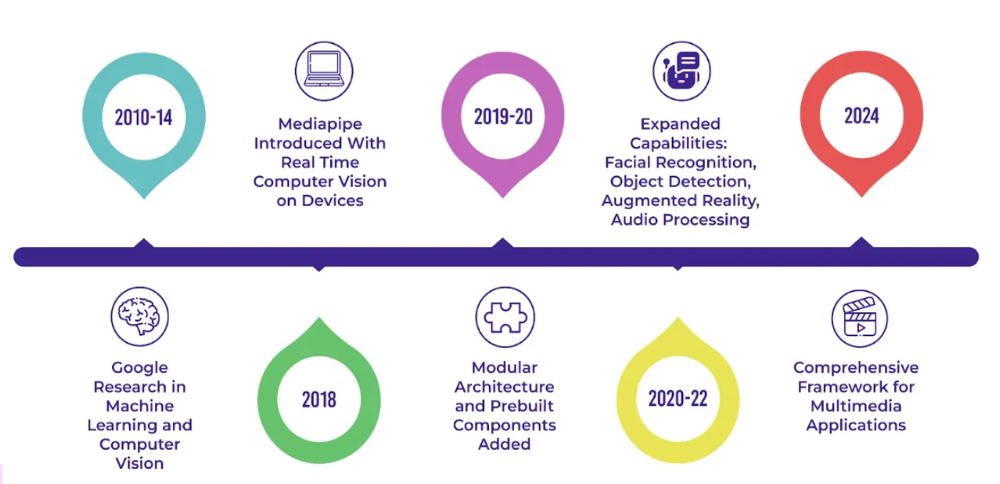
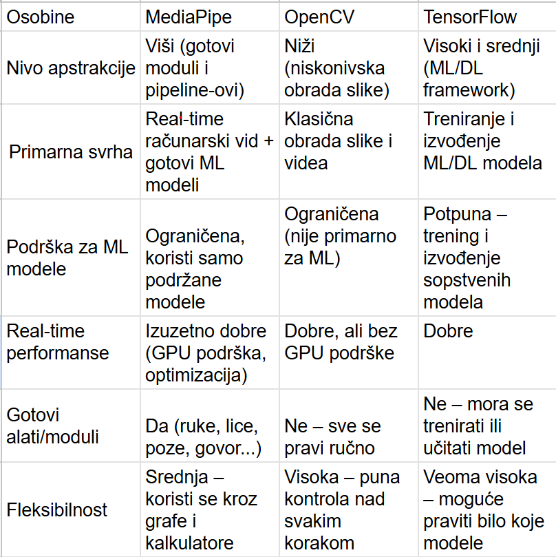

## Sign-language
Aplikacija omogućava osobama oštećenog sluha lakšu komunikaciju sa osobama koje nemaju taj problem. Razvijena je u Pythonu, koristeći biblioteku MediaPipe, koja omogućava praćenje pokreta prstiju u realnom vremenu, koristeći algoritme za prepoznavanje ključnih tačaka na ruci.

## Sadržaj

- [Problem koji aplikacija rešava?](#problem-koji-aplikacija-rešava)
- [Struktura projekta](#struktura-projekta)
- [Media pipe biblioteka](#media-pipe-biblioteka)
- [Realizacija projekta](#realizacija-projekta)
- [Koje kompanije i projekti su pokušali da reše problem](#koje-kompanije-i-projekti-su-pokušali-da-reše-problem)
- [Instalacija](#instalacija)

### Problem koji aplikacija rešava?
Glavni problem sa kojim se suočavaju osobe oštećenog sluha je način na koji komuniciraju sa ljudima koji ne poznaju znakovni jezik. U Srbiji je ovaj problem posebno izražen, jer prema podacima Saveza gluvih i nagluvih Srbije, oko 70.000 osoba koristi srpski znakovni jezik kao svoj prvi jezik. Nažalost, u Srbiji postoji oko 30 tumača znakovnog jezika za 70.000 ljudi. Nedostatak tumača ozbiljno otežava svakodnevni život osoba koje koriste znakovni jezik. Takođe, usluga tumača je uglavnom dostupna samo u kritičnim situacijama, dok su svakodnevne potrebe ove zajednice često zapostavljene.
Ova aplikacija ima za cilj da pomogne u prevazilaženju tog problema. Korišćenjem kamere, korisnici mogu pokazati znak, a aplikacija će prepoznati i prikazati odgovarajuće slovo. Takođe, postoji opcija u kojoj korisnik može izgovoriti slovo putem mikrofona, a aplikacija će to slovo pretvoriti u odgovarajući znak.

### Media pipe biblioteka


#### Nastanak Media pip-a
MedijaPipe ima korene iz ranih 2010-ih kada je Google radio na unapređenju tehnologija mašinskog učenja i računarskog vida. Prvi put je korišćen 2012. godine za analizu video i audio sadržaja u realnom vremenu na YouTube-u.
godine, MediaPipe je počeo da rešava probleme vezane za korišćenje složenih modela računarskog vida na uređajima kao što su pametni telefoni i mali računari. Do 2020. godine, javila se rastuća potreba za brzim i efikasnim načinom obrade multimedijalnih sadržaja, pa je MediaPipe ažuriran kako bi odgovorio na ovu potrebu. Danas, MediaPipe ostaje snažna biblioteka za programere koji žele da kreiraju inovativne multimedijalne aplikacije koje funkcionišu veoma dobro.

#### Osnovne funkcionalnosti i tehnologije
MediaPipe dolazi sa mnogim uzbudljivim funkcijama. Jedna od ključnih karakteristika je mogućnost korišćenja snage GPU-ova za bržu obradu podataka. Zahvaljujući ovoj tehnologiji, MediaPipe može obrađivati čak i najzahtevnije multimedijalne zadatke u realnom vremenu. Takođe, zahvaljujući paralelnom procesiranju, MediaPipe može istovremeno obavljati više zadataka, kao što je procesiranje više video tokova ili pokretanje više modela računarskog vida istovremeno.

Pored toga, MediaPipe koristi OpenCV, moćnu open-source biblioteku za računarski vid. OpenCV pruža mnoge alate i algoritme za obradu slika i video zapisa. Zahvaljujući OpenCV-u, MediaPipe lako dodaje funkcionalnosti poput video snimanja, obrade i prikaza u svojim procesnim tokovima. Takođe se integriše sa TensorFlow-om, Google-ovim alatom za mašinsko učenje, što olakšava dodavanje unapred treniranih ili prilagođenih modela. To omogućava jednostavne zadatke poput prepoznavanja lica ili razumevanja govora.

MediaPipe podržava i popularne programske jezike poput C++, Java i Python, što olakšava njegovu primenu u različitim projektima.

#### Modularna arhitektura i grafovi
Jedna od najvažnijih funkcionalnosti MediaPipe-a je njegova modularna arhitektura koja koristi Dataflow Graphs. Ovi grafovi se sastoje od "kalkulatora" (calculators - to je komponenta koja prima podatke, obrađuje ih i vraća rezultat). Svaki calculator ima jasno definisane ulaze i izlaze i radi samo jednu stvar, što olakšava organizaciju i ponovno korišćenje koda. Na primer, jedan kalkulator može da čita video ulaz, drugi da izvršava detekciju lica, dok treći prikazuje rezultat.
Pipeline (ili Dataflow Graph) je niz povezanih calculatora. To je lanac kroz koji putuju podaci. Svaki calculator je karika u tom lancu. MediaPipe koristi grafove da poveže te kalkulatore i definiše kojim redosledom i kako se podaci kreću.
Zahvaljujući ovom modularnom pristupu, razvoj kompleksnih sistema postaje jednostavniji jer se funkcionalnosti mogu lako dodavati, uklanjati ili kombinovati bez potrebe za promenom cele aplikacije.

#### Podrška za različite platforme
MediaPipe je dizajniran da radi na više platformi. Podržava operativne sisteme kao što su Linux, Windows, macOS, Android i iOS. Ovo omogućava razvoj aplikacija koje mogu funkcionisati i na desktop i na mobilnim uređajima. Posebno je optimizovan za mobilne uređaje, čime omogućava izvođenje složenih zadataka računarskog vida direktno na telefonu bez potrebe za internet konekcijom.

#### Predefinisani modeli i rešenja
MediaPipe dolazi sa velikim brojem unapred definisanih rešenja koja omogućavaju brzo postavljanje sistema bez potrebe za dodatnim treniranjem modela. Neka od najpoznatijih rešenja uključuju:
Face Detection – detekcija lica u realnom vremenu<br>
Face Mesh – mapiranje preko 400 tačaka na licu<br>
Hand Tracking – precizno praćenje pokreta ruku i prstiju - koji je korišćen u samoj aplikaciji<br>
Pose Estimation – analiza položaja tela<br>
Objectron – 3D detekcija objekata<br>
Holistic – kombinovano praćenje tela, ruku i lica<br>
Selfie Segmentation – odvajanje korisnika od pozadine<br>
Hair Segmentation – segmentacija kose<br>
Gesture Recognition – prepoznavanje pokreta i gestikulacija<br>

## Prednosti MediaPipe
#### MediaPipe nudi gotove i dobro optimizovane modele pa samim tim nema potrebe za treniranjem sopstvenih modela:
Detekciju ruku, praćenje lica, detekciju tela, detekciju objekata, OCR (prepoznavanje teksta)
#### Visoke performanse u realnom vremenu
Optimizovan za rad u realnom vremenu, čak i na mobilnim uređajima
#### Višeplatformska podrška
Radi na Windows, Linux, macOS, Android i iOS. Može se koristiti sa Python-om, C++, JavaScript-om, pa čak i u Unity okruženju
#### Modularna arhitektura
Koristi "pipeline" pristup: svaki deo obrade (npr. prepoznavanje, filtriranje, vizualizacija) je modularan i može se prilagoditi.
Lako moze da se kombinuju moduli ili da se napravi sopstveni
#### Besplatan i open-source
Razvijen od strane Google-a i objavljen pod Apache 2.0 licencom. Može se koristiti u komercijalnim i nekomercijalnim projektima.
#### Laka integracija
Pruža jednostavne API-je. Može se lako integrisati u postojeće projekte.

## Mane MediaPipe 
#### Ograničena prilagodljivost modela
MediaPipe koristi unapred trenirane modele. Ne može se lako trenirati sopstveni modeli unutar MediaPipe okruženja. Nije pogodno za projekte koji zahtevaju specifičnu detekciju objekata ili klasifikaciju prilagođenu tvojoj aplikaciji.
#### Ograničena preciznost i robusnost
Radi odlično u kontrolisanim uslovima, ali: gubi preciznost pri lošem osvetljenju, ima problema sa delimično zaklonjenim objektima (npr. ruke iza tela), teže se nosi sa brzim pokretima ili neobičnim pozama
#### Ograničena fleksibilnost na mobilnim uređajima
Iako postoji podrška za Android i iOS, integracija u mobilne aplikacije može biti teža i zahtevnija u poređenju sa drugim bibliotekama poput TensorFlow Lite.
#### Nedostatak detaljne dokumentacije za napredne primene

## Kada je potrebno koristiti MediaPipe
Ako treba brzo rešenje za obradu slike ili video streama, ako se radi na projektima sa interakcijom preko pokreta, ruku, lica ili tela.

## MediaPipe vs Open CV vs TensorFlow/PyTorch



## create virtual environment

```
python -m venv .venv
```

## Select interpreter

```
ctrl+shift+p -> python select interpreter
```


## Dependenices

### Generate requirements.txt from an existing environment:

```
pip freeze > requirements.txt
```

### Install libraries from the requirements.txt file

```
pip install -r requirements.txt
```
